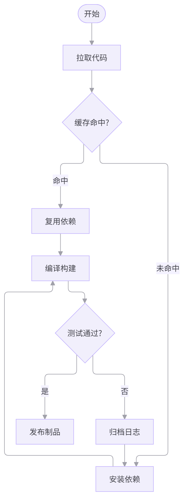
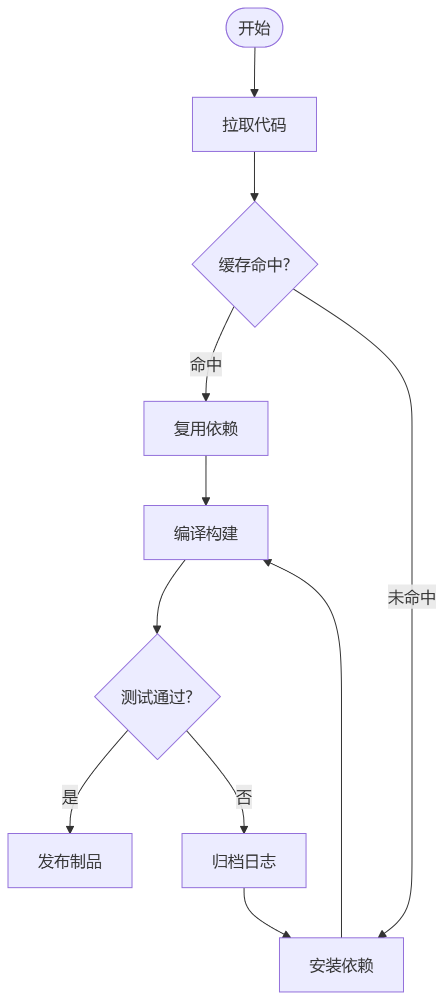
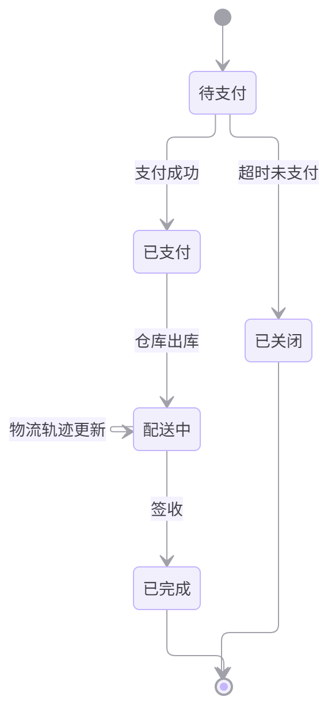
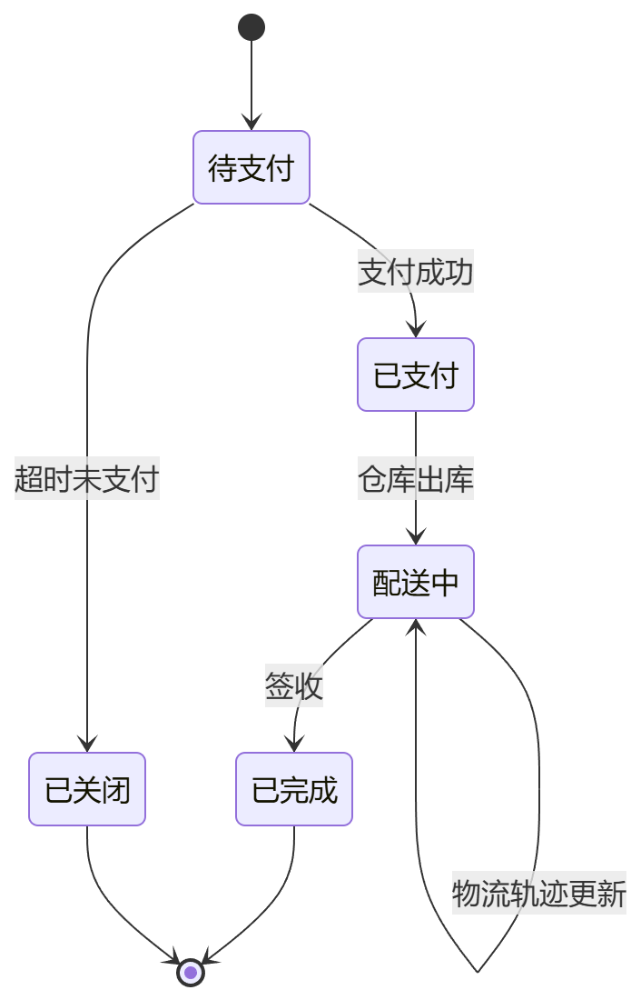
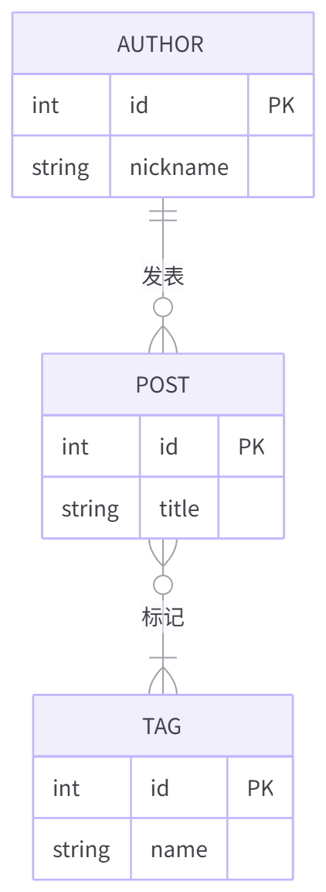
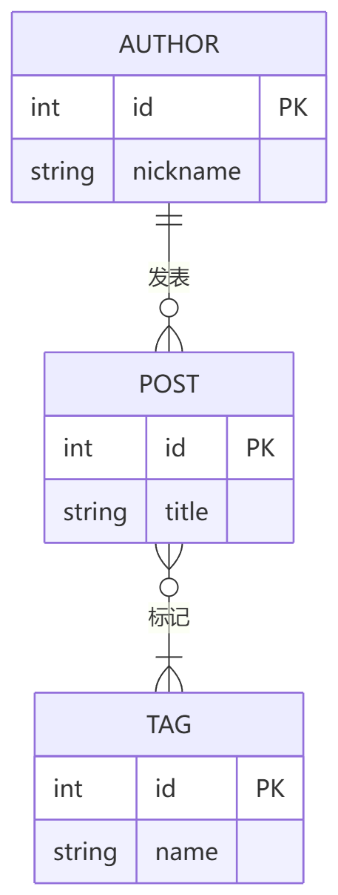
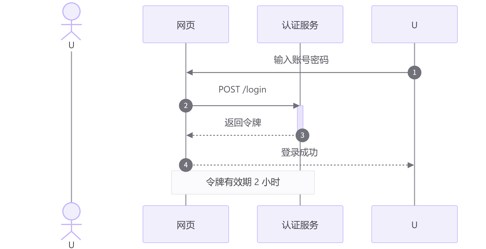
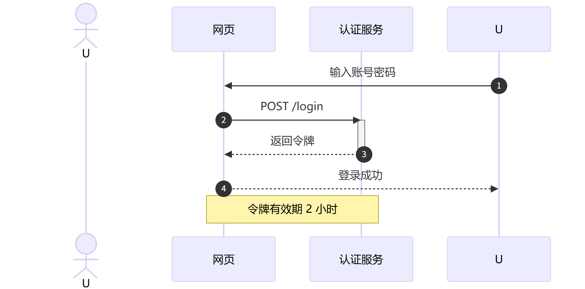
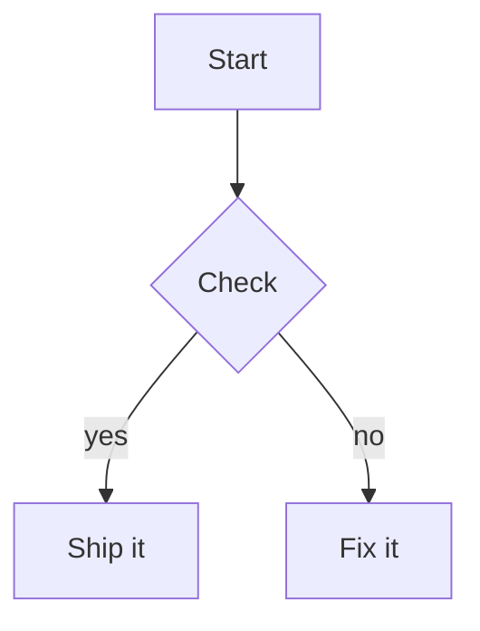
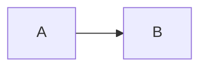

# Clean Mermaid

[](README.md) [](README.zh-CN.md)

Clean Mermaid renders every ` ```mermaid ` block in Obsidian as a tidy card: white canvas, soft
violet nodes, generous whitespace and a floating toolbar — with **ELK layout**, auto-fit, zoom &
pan, fullscreen view, PNG/SVG export and themable colours.

## Features

- **Every ` ```mermaid ` block is rendered by this plugin** (reading view and live preview) with a
  clean card: centred diagram, auto-fit to the editor width, subtle border, floating controls.
- **ELK layout engine by default** — bundled `mermaid` 12 already ships ELK, so complex flowcharts
  get the nicer layered layout. Switch to Dagre globally or per diagram when you prefer it.
- **Auto-fit & centre** — diagrams scale with the pane width and are capped to a share of the
  viewport height, so a huge diagram never takes over the note.
- **Zoom & pan** — `Ctrl/Cmd + scroll` zooms around the pointer (10 %–800 %), drag to pan a
  zoomed-in diagram, double-click to reset. Plain scrolling still scrolls the note.
- **Image preview** — diagrams are displayed as `` (SVG data URL), so Obsidian themes and
  CSS snippets cannot restyle them; what you see is what you export.
- **Export** — download a 2× PNG, an SVG, or copy the image / the Mermaid source from the `⋯` menu.
- **Fullscreen viewer** (`⤢`) — pan, wheel/pinch zoom, fit, 100 %, export.
- **4 built-in themes** — Clean Light, Clean Dark, Neutral, GitHub Light — plus **custom themes**
  as plain Mermaid `themeVariables` JSON, with validation.
- **Light/dark aware** — follows the Obsidian appearance automatically and re-renders on switch.
- **UI language** — the card toolbar, the `⋯` menu, the error card, the fullscreen viewer and every
  notice follow 中文 / English, or Obsidian's own interface language when set to "Auto".
- **Per-diagram directives** — `%% cm:theme=... %%`, `%% cm:layout=dagre %%`, `%% cm:plain %%`.

## Rendering comparison

Every pair below is the same diagram source. **Left** is this plugin with its factory defaults (ELK
layout, Clean Light theme, card). **Right** is Obsidian's own renderer — the mermaid 11.13.0 build
shipped inside Obsidian 1.14.4, initialised with Obsidian's own arguments (mermaid's default theme,
no `layout` key, so Dagre). Both sides are displayed at the same width; the plugin auto-fits while
Obsidian pins flowcharts to the reading-column width, so absolute pixel size is not part of the claim.

Both panels are generated from the diagram sources in `tests/browser/capture-diagrams.ts` by a
maintainer script — nothing here is hand-edited or retouched.

### Flowchart — layout engine

| Clean Mermaid (ELK) | Obsidian native (Dagre) |
| --- | --- |
|  |  |

### State diagram — spacing and edge routing

| Clean Mermaid (ELK) | Obsidian native (Dagre) |
| --- | --- |
|  |  |

### ER diagram — entity boxes

| Clean Mermaid (ELK) | Obsidian native (Dagre) |
| --- | --- |
|  |  |

### Sequence diagram — colours only

ELK does not drive sequence diagrams, so the layout is identical on both sides; only the theme and
typography differ. Kept here so the comparison does not overstate what the layout engine changes.

| Clean Mermaid | Obsidian native |
| --- | --- |
|  |  |

## Installation

### Manual

1. Download `main.js`, `manifest.json` and `styles.css` from the latest release.
2. Put them into `<your-vault>/.obsidian/plugins/clean-mermaid/`.
3. Enable **Clean Mermaid** in *Settings → Community plugins*.

### From source

```bash
npm install
npm run build
npm run deploy -- <vault-name>
```

## Usage

Write Mermaid as usual:

````markdown

````

### Interactions

| Action | Gesture |
| --- | --- |
| Zoom | `Ctrl`/`Cmd` + scroll (inline), wheel or pinch (fullscreen) |
| Pan | Drag with the left mouse button (when zoomed in) |
| Reset to auto-fit | Double-click, or `Reset zoom` in the `⋯` menu |
| Menu | `⋯` in the card corner — PNG, SVG, copy image, copy source, reset |
| Fullscreen | `⤢` in the card corner |

### Directives

Directives must be the first lines of the block and are stripped before rendering:

````markdown

````

| Directive | Effect |
| --- | --- |
| `%% cm:theme=<id> %%` | Use a built-in or custom theme for this diagram only |
| `%% cm:layout=elk\|dagre %%` | Override the layout engine for this diagram only |
| `%% cm:plain %%` | Render this diagram with mermaid's stock look (no card, no toolbar) |

Your own `%%{init: ...}%%` directive always wins over what the plugin injects — the plugin
prepends its configuration, so the values you write later take precedence. For instance the
plugin injects `look: "classic"` (flat nodes, no drop shadow) and lifts mermaid's 120px node
width defaults; put `%%{init: {"look":"neo"}}%%` in a block to bring the shadows back for it.

## Settings

| Group | Options |
| --- | --- |
| *(no heading, at the top)* | Plugin interface language (card toolbar, `⋯` menu, error card, viewer, notices): follow Obsidian automatically, 中文 or English |
| Appearance | Light/dark theme, follow Obsidian appearance, fixed theme |
| Layout | Layout engine (ELK/Dagre), ELK `mergeEdges`, ELK `nodePlacementStrategy`, auto-fit mode, max upscale, max height |
| Interaction | Ctrl/Cmd + scroll zoom, drag to pan, toolbar visibility, double-click reset |
| Rendering | Enable Clean Mermaid rendering, render as image, `%% cm: %%` directives |
| Export | PNG resolution (1×/2×/3×), PNG background (theme/transparent) |
| Custom themes | Add, edit (JSON), delete; invalid JSON is rejected and the last valid version stays |

## Notes & compatibility

- **Bundled runtime.** The plugin ships its own `mermaid` 12 build (including ELK), so it does not
  depend on the Mermaid version bundled with Obsidian. This makes `main.js` larger than a typical
  plugin (a few MB) — that is the price for a predictable, standalone renderer.
- **How the takeover works.** Reading view uses the standard `mermaid` code block processor
  (registered ahead of Obsidian's own). Live preview is a special case: Obsidian renders mermaid
  there with a hard-coded core renderer that ignores that registry, so the plugin watches the
  rendered widget, reads the diagram source from the editor state and swaps the output for its own
  card. Obsidian's per-vault “trust mermaid” prompt is respected in both views.
- **Layout engine.** ELK affects diagrams with pluggable layouts (flowchart, state, class, ER, …).
  Sequence, pie, gantt and similar diagrams use their own layout and are unaffected.
- **Other mermaid plugins.** Only enable **one** plugin that takes over ` ```mermaid ` blocks.
  If another renderer is detected, Clean Mermaid shows a one-time notice.
- **Desktop only.** `manifest.json` declares `isDesktopOnly`, so Obsidian mobile does not load the
  plugin; exports always use the browser download.
- **Tested Obsidian version.** `minAppVersion` is `1.14.4` — the only build this takeover has been
  verified against. Live preview relies on undocumented Obsidian selectors and hooks, so older
  builds are not promised to work; see [docs/obsidian-internals.md](docs/obsidian-internals.md).
- **Disabling** the plugin restores Obsidian's own Mermaid rendering; nothing is patched globally.

## Development

```
src/
  main.ts             plugin entry: processor registration, live preview extension, commands
  block.ts            one rendered diagram: card DOM, interactions, exports
  directives.ts       %% cm: %% per-diagram directive parsing (pure, unit-tested)
  livepreview.ts      live preview takeover of Obsidian's rendered mermaid widgets
  mermaid-runtime.ts  bundled mermaid + config injection + LRU cache
  themes.ts           built-in themes, custom theme parsing/resolution
  fit.ts              pure auto-fit math
  viewer.ts           fullscreen pan/zoom modal
  export.ts           PNG/SVG/clipboard export helpers
  i18n.ts             language detection + the bilingual picker used by every label
  settings.ts         settings model + settings tab
tests/                vitest unit tests for the pure modules, plus tests/browser/ harnesses
```

```bash
npm install          # install dependencies
npm run dev          # esbuild watch build
npm run build        # type-check + production build (main.js)
npm test             # unit tests (no Obsidian needed)
npm run test:browser # browser harnesses for real mermaid rendering
npm run deploy -- <vault-name>   # tests → build → copy the build into a vault you name
```

See [CONTRIBUTING.md](CONTRIBUTING.md) for conventions and the manual acceptance checklist.
No local vault paths are ever committed — the deploy script resolves the vault name through Obsidian's
own registry (a full path works too, for a vault you have not opened in Obsidian yet).

## License

[MIT](LICENSE) © Clean Mermaid contributors

`main.js` bundles mermaid and its dependencies — their licences are listed in
[THIRD-PARTY-LICENSES.md](THIRD-PARTY-LICENSES.md).

---

中文文档：[README.zh-CN.md](README.zh-CN.md) · 贡献指南：[CONTRIBUTING.zh-CN.md](CONTRIBUTING.zh-CN.md)