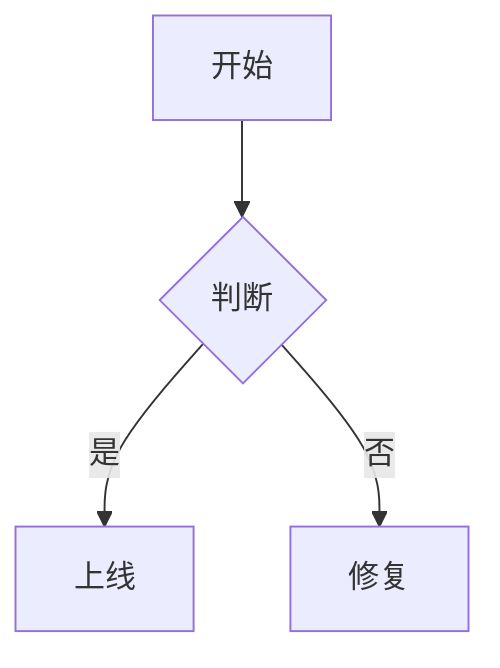
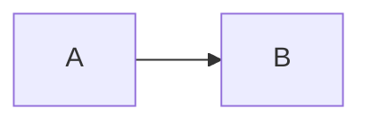

# Clean Mermaid

[](README.md) [](README.zh-CN.md)

Clean Mermaid 把 vault 里每个 ` ```mermaid ` 代码块渲染成一张干净的卡片：白色画布、淡紫节点、
充足留白与悬浮工具条 —— 支持 **ELK 布局**、自适应缩放、缩放与平移、全屏查看、PNG/SVG 导出
以及可自定义的主题配色。

## 功能特性

- **所有 ` ```mermaid ` 代码块都由本插件渲染**（阅读视图与实时预览）：居中图表、按编辑器宽度
  自适应、细边框卡片、悬浮控件。
- **默认使用 ELK 布局引擎** —— 插件自带的 `mermaid` 12 已内置 ELK，复杂流程图能获得更清晰的
  分层排布；也可在设置中或按图切回 Dagre。
- **自适应与居中** —— 图表随分栏宽度缩放，并受视口高度比例上限约束，超大图表不会占满整篇笔记。
- **缩放与平移** —— `Ctrl/Cmd + 滚轮`以指针为中心缩放（10%–800%），放大后可拖拽平移，双击复位；
  普通滚轮仍然照常滚动笔记。
- **图片化预览** —— 图表以 ``（SVG data URL）显示，Obsidian 主题与 CSS 片段无法改变其样式，
  所见即所得。
- **导出** —— 在 `⋯` 菜单中下载 2× PNG、SVG，或复制图片 / 复制 Mermaid 源码。
- **全屏查看器**（`⤢`）—— 平移、滚轮/双指缩放、适应、100%、导出。
- **4 个内置主题** —— Clean Light、Clean Dark、Neutral、GitHub Light；另支持以标准 Mermaid
  `themeVariables` JSON 编写的**自定义主题**，并带校验。
- **明暗自适应** —— 跟随 Obsidian 外观自动切换，并在切换时即时重绘。
- **界面语言** —— 卡片工具条、`⋯` 菜单、错误卡片、全屏查看器与提示等全部文案跟随中文 / English，
  选「自动」时跟随 Obsidian 的界面语言。
- **单图指令** —— `%% cm:theme=... %%`、`%% cm:layout=dagre %%`、`%% cm:plain %%`。

## 渲染对比

下面每一组都是同一份图表源码。**左**侧是本插件的出厂默认（ELK 布局、Clean Light 主题、卡片）；
**右**侧是 Obsidian 自己的渲染 —— Obsidian 1.14.4 内置的那份 mermaid 11.13.0，并按 Obsidian 自己的
参数初始化（mermaid 默认主题、不写 `layout` 键，因此走 Dagre）。两侧按同一显示宽度呈现：插件做自适应，
Obsidian 则把流程图锁在阅读列宽度上，所以像素尺寸本身不在对比结论里。

两侧都由 `tests/browser/capture-diagrams.ts` 里的同一份源码经维护者本机脚本生成，没有手工修图。

### 流程图 —— 布局引擎

| Clean Mermaid（ELK） | Obsidian 原生（Dagre） |
| --- | --- |
|  |  |

### 状态图 —— 间距与连线走向

| Clean Mermaid（ELK） | Obsidian 原生（Dagre） |
| --- | --- |
|  |  |

### ER 图 —— 实体框

| Clean Mermaid（ELK） | Obsidian 原生（Dagre） |
| --- | --- |
|  |  |

### 时序图 —— 只有配色不同

时序图不由 ELK 驱动，两侧布局完全一致，差别只在主题配色与字体。放进来是为了不把布局引擎的作用说满。

| Clean Mermaid | Obsidian 原生 |
| --- | --- |
|  |  |

## 安装

### 手动安装

1. 从最新 Release 下载 `main.js`、`manifest.json`、`styles.css`。
2. 放入 `<你的 Vault>/.obsidian/plugins/clean-mermaid/`。
3. 在 *设置 → 第三方插件* 中启用 **Clean Mermaid**。

### 从源码构建

```bash
npm install
npm run build
npm run deploy -- <库名>
```

## 使用

照常编写 Mermaid：

````markdown

````

### 交互

| 操作 | 手势 |
| --- | --- |
| 缩放 | `Ctrl`/`Cmd` + 滚轮（内联），滚轮或双指捏合（全屏） |
| 平移 | 放大后按住鼠标左键拖动 |
| 复位到自适应 | 双击图表，或 `⋯` 菜单中的「重置缩放」 |
| 菜单 | 卡片右上角 `⋯` —— PNG、SVG、复制图片、复制源码、重置缩放 |
| 全屏 | 卡片右上角 `⤢` |

### 指令

指令需写在代码块最前面，渲染前会被剥离：

````markdown

````

| 指令 | 作用 |
| --- | --- |
| `%% cm:theme=<id> %%` | 仅本图使用指定内置或自定义主题 |
| `%% cm:layout=elk\|dagre %%` | 仅本图覆盖布局引擎 |
| `%% cm:plain %%` | 本图按 mermaid 原生外观渲染（无卡片、无工具条） |

你自己写的 `%%{init: ...}%%` 指令优先级始终高于插件注入的配置 —— 插件把配置注在最前面，
后面写的值会覆盖它。

## 设置

| 分组 | 选项 |
| --- | --- |
| *（置顶，无分组标题）* | 插件界面语言（卡片工具条、`⋯` 菜单、错误卡片、全屏查看器与提示）：自动跟随 Obsidian、中文或 English |
| 外观 | 浅色/深色主题、跟随 Obsidian 明暗、固定主题 |
| 布局 | 布局引擎（ELK/Dagre）、ELK `mergeEdges`、ELK `nodePlacementStrategy`、自适应方式、最大放大倍率、最大高度 |
| 交互 | Ctrl/Cmd + 滚轮缩放、拖拽平移、工具条显示方式、双击复位 |
| 渲染 | 启用 Clean Mermaid 渲染、图片化渲染、`%% cm: %%` 指令支持 |
| 导出 | PNG 分辨率（1×/2×/3×）、PNG 背景（主题/透明） |
| 自定义主题 | 新增、编辑（JSON）、删除；非法 JSON 会被拒绝并保留上一版生效值 |

## 说明与兼容性

- **自带运行时。** 插件自带 `mermaid` 12（含 ELK），不依赖 Obsidian 内置的 Mermaid 版本，
  代价是 `main.js` 比一般插件大（数 MB）。
- **接管方式。** 阅读视图使用标准的 `mermaid` 代码块处理器（注册顺序排在 Obsidian 自己的
  处理器之前）。实时预览则是特例：Obsidian 在那里用硬编码的核心渲染器渲染 mermaid、完全不查询
  处理器注册表，因此插件会监听已渲染的部件、从编辑器状态中取出图表源码，再用自己的卡片替换
  官方输出。Obsidian 的「信任此 vault 渲染 mermaid」提示在两种视图下都会被尊重。
- **布局引擎。** ELK 影响支持可插拔布局的图型（flowchart、state、class、ER 等）；时序图、饼图、
  甘特图等使用自有布局，不受影响。
- **与其他 mermaid 插件共存。** 请只启用**一个**接管 ` ```mermaid ` 的插件；若检测到其它渲染器，
  Clean Mermaid 会给出一次提示。
- **仅桌面。** `manifest.json` 声明 `isDesktopOnly`，Obsidian 移动端不会加载本插件；导出一律走
  浏览器下载。
- **实测过的 Obsidian 版本。** `minAppVersion` 为 `1.14.4` —— 接管逻辑只在这个版本实测过；实时
  预览依赖未公开的 Obsidian 选择器与钩子，因此不承诺更老的版本可用，细节见
  [docs/obsidian-internals.md](docs/obsidian-internals.md)。
- **禁用插件**后图表恢复为 Obsidian 自带的 Mermaid 渲染，插件没有对全局做任何改写。

## 开发

```
src/
  main.ts             插件入口：处理器注册、实时预览扩展、命令
  block.ts            单个图表：卡片 DOM、交互、导出
  directives.ts       `%% cm: %%` 单图指令解析（纯逻辑，有单测）
  livepreview.ts      实时预览下接管 Obsidian 已渲染的 mermaid 部件
  mermaid-runtime.ts  自带 mermaid + 配置注入 + LRU 缓存
  themes.ts           内置主题、自定义主题解析与校验
  fit.ts              纯函数自适应计算
  viewer.ts           全屏缩放/平移弹窗
  export.ts           PNG/SVG/剪贴板导出
  i18n.ts             语言检测与中英取词，供全部界面文案使用
  settings.ts         设置模型与设置面板
tests/                纯逻辑模块的 vitest 单测；tests/browser/ 为浏览器验证脚本
```

```bash
npm install          # 安装依赖
npm run dev          # esbuild 监听构建
npm run build        # 类型检查 + 生产构建（main.js）
npm test             # 单元测试（不需要 Obsidian）
npm run test:browser # 用浏览器验证真实 mermaid 渲染
npm run deploy -- <库名>   # 单测 → 构建 → 把产物复制进你指定的库
```

协作规范与手动验收清单见 [CONTRIBUTING.zh-CN.md](CONTRIBUTING.zh-CN.md)。仓库中不会提交任何本地
vault 路径 —— 部署脚本用 Obsidian 自己的注册表把库名换算成路径（还没在 Obsidian 里打开过的库可以直接给完整路径）。

## 许可证

[MIT](LICENSE) © Clean Mermaid contributors

`main.js` 打包了 mermaid 及其依赖，它们的许可见
[THIRD-PARTY-LICENSES.md](THIRD-PARTY-LICENSES.md)。

---

English docs: [README.md](README.md) · [CONTRIBUTING.md](CONTRIBUTING.md)